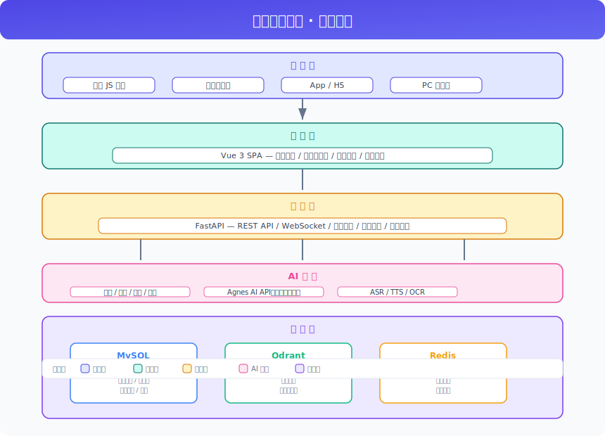
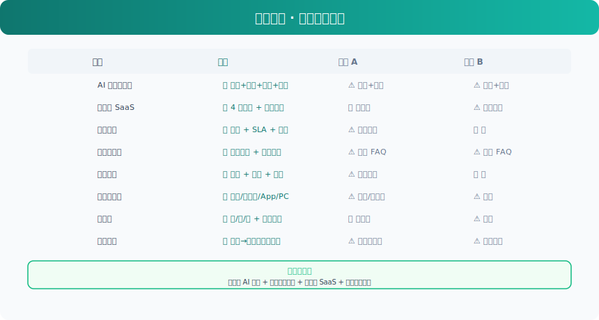

# 智能客服系统 PRD v3

> 基于 Agnes AI 多模态模型（文本、图像、视频、语音），使用 Vue 3 + FastAPI 前后端分离架构，构建支持多租户 SaaS 化部署、多渠道接入、工单流转的企业级 AI 智能客服系统。

---

## 一、执行摘要

面向中小企业的 AI 智能客服 SaaS 平台。通过 Agnes AI 多模态模型，实现自动问答、图片/视频/语音理解、知识库检索、转人工、工单流转等完整客服闭环。帮助商家降低人工客服成本 60% 以上，提升客户满意度。

---

## 二、问题定义

### 2.1 背景

传统客服面临三大痛点：
- **人力成本高**：7×24 小时值守需要大量客服人员，单月人力成本数千至数万元
- **响应慢**：高峰期排队等待时间长，客户流失率高
- **知识分散**：FAQ、产品文档、售后政策等信息散落各处，客服难以快速检索

### 2.2 用户痛点（JTBD）

**当** 商家或消费者 **在** 日常业务咨询、售后问题处理 **时，**
**他们需要** 快速获得准确的答案和专业的服务 **，**
**但目前面临** 人工客服响应慢、知识库分散、多渠道接入困难 **，**
**导致** 客户满意度下降、客服人力成本持续攀升、业务增长受限。

### 2.3 目标用户

**主要用户群体**：中小企业商家、品牌方

**用户画像**：
- 电商卖家、SaaS 服务商、内容创作者
- 日均咨询量 100~5000 条
- 客服团队 1~20 人
- 当前替代方案：人工值守、第三方客服工具（缺乏 AI 能力）
- 最痛的三个点：人力成本、响应速度、知识管理

### 2.4 市场机会

| 指标 | 数值 | 来源 |
|------|------|------|
| TAM（总可寻址市场） | 全球客服 SaaS 市场 $50B+ | Gartner 2025 |
| SAM（可服务市场） | 中国中小企业客服 SaaS | 艾瑞咨询 |
| SOM（可获取份额） | 初期聚焦 1000+ 租户 | 推断 |
| 市场增长率 | AI 客服年增 35%+ | 行业报告 |

---

## 三、解决方案

### 3.1 产品定位

> 我们是 **AI 智能客服 SaaS 平台**，帮助 **中小企业** **降低 60% 客服成本并提供 7×24 小时服务**，不像传统客服外包，我们通过 **Agnes AI 多模态模型 + 知识库 + 工单系统** 实现端到端智能化。

### 3.2 功能架构

> 系统分为五层：渠道层（用户入口）→ 前端层（Vue 3 SPA）→ 后端层（FastAPI）→ AI 服务层（Agnes AI 多模态模型）→ 数据层（MySQL + Qdrant + Redis），各层通过 REST API / WebSocket 通信。

### 3.3 核心功能（MoSCoW 优先级）

#### ✅ Must Have（MVP 必须包含）

| 功能 | 用户故事 | 验收标准 | 优先级 |
|------|---------|---------|--------|
| AI 自动问答 | 作为消费者，我想随时得到回复 | 消息发送后 3s 内返回 AI 回复，准确率 > 80% | P0 |
| 知识库管理 | 作为商家，我想导入产品文档供 AI 学习 | 支持 Markdown/PDF 导入，100 篇文档检索 < 1s | P0 |
| 转人工 | 作为消费者，我想在 AI 无法回答时转接人工 | 点击转人工后 10s 内有人工客服接入 | P0 |
| 客服工作台 | 作为客服，我想同时处理多个用户会话 | 支持至少 5 个并发会话，消息实时推送 | P0 |
| 数据分析 | 作为运营，我想看到客服绩效数据 | 对话量、满意度、响应时长实时可查 | P1 |

#### 🔶 Should Have（重要但 MVP 可简化）

- 图片/视频理解（调用 Agnes 图像/视频模型）
- 工单系统（基础流转 + SLA 提醒）
- 多租户管理（共享表模式起步）
- 满意度评价（对话后弹窗评分）
- 快捷回复话术

#### 🔷 Could Have（有余力再做）

- 语音输入/输出（ASR + TTS）
- OCR 截图识别
- 埋点分析 + 用户画像
- 国际化（多语言）
- PC 客户端

#### ❌ Won't Have（本期明确不做）

| 功能 | 排除原因 |
|------|---------|
| 电话客服接入 | 初期聚焦在线渠道，电话涉及硬件改造 |
| 视频通话 | 技术复杂度高，非核心路径 |
| 自研大模型 | 使用 Agnes AI API，不自研 |

### 3.4 非功能需求

| 维度 | 要求 | 验证方式 |
|------|------|---------|
| 性能 | 消息响应 < 3s，P95 < 5s | 压测 / 监控 |
| 安全 | 租户数据严格隔离，JWT 鉴权 | 安全审计 |
| 可用性 | ≥ 99.9% Uptime | 监控告警 |
| 扩展性 | 支持 1000+ 并发用户 | 架构评审 |
| 兼容性 | Chrome / Edge / Safari / 微信内置浏览器 | 兼容性测试 |

---

## 四、功能模块

### 4.1 多租户 SaaS

#### 4.1.1 租户管理
- **租户注册**：支持自助注册和邀请注册
- **租户信息**：企业名称、行业分类、联系人、联系方式
- **租户套餐**：
  - 免费版：1 客服、1000 条对话/月、基础知识库
  - 标准版：5 客服、10000 条对话/月、完整知识库
  - 专业版：20 客服、50000 条对话/月、高级分析
  - 企业版：不限客服、无限对话、定制功能
- **租户隔离策略**：
  - 共享表模式（免费/标准）：共用表 + `tenant_id` 隔离
  - 独立数据库模式（专业版/企业版）：每个租户独立数据库实例，最高级别隔离性和安全性

#### 4.1.2 租户后台
- 每个租户拥有独立后台管理界面
- 租户管理员可配置本租户所有参数
- 租户间共享平台级配置（如 AI 模型供应商）

### 4.2 用户体系

#### 4.2.1 注册用户
- 消费者可注册平台账号，跨租户使用统一身份
- 支持手机号、邮箱、微信、QQ 注册
- 用户资料：昵称、头像、性别、生日、地区

#### 4.2.2 会员等级
- 自动划分等级：普通、白银、黄金、钻石
- 不同等级享受不同权益（优先接入人工、专属通道）

#### 4.2.3 积分体系
- 签到、评价、分享获得积分
- 积分可兑换优惠券、会员时长

### 4.3 聊天核心

#### 4.3.1 多轮对话
- 用户发送消息，后端调用配置的文本模型返回 AI 回复
- 对话上下文通过 MySQL 存储，携带最近 N 轮消息（可配置，默认 10 轮）
- 支持流式输出（SSE/WebSocket），降低用户感知延迟
- 支持上下文记忆：跨会话记忆用户偏好和历史问题

#### 4.3.2 图片识别
- 用户上传图片后，后端调用图像识别模型进行图像理解
- 返回图片描述，AI 结合上下文生成回复

#### 4.3.3 视频理解
- 用户上传视频后，后端调用视频分析模型进行分析
- 返回关键帧描述或摘要，AI 基于描述生成回复

#### 4.3.4 语音能力
- **语音输入**：用户发送语音，后端调用 ASR 模型转为文本后送入 AI
- **TTS 回复**：AI 回复可选择语音形式播放，支持多种音色和语速
- **语音消息上传**：支持 .wav/.mp3/.ogg 格式，最大 10MB

#### 4.3.5 OCR 识别
- 用户上传截图/照片，后端调用 OCR 模型识别文字内容
- 识别结果直接作为对话上下文，AI 基于文字内容回复
- 支持中文、英文、日文等多语言识别

#### 4.3.6 转人工
- 支持三种触发模式（后台配置）：
  - **用户主动触发**：用户点击"转人工"按钮
  - **AI 自动触发**：AI 识别到问题不在知识库范围内（置信度低于阈值），主动建议转人工
  - **两者结合**：以上两种方式均可触发
- 转人工后，AI 对话历史自动同步给人工客服

### 4.4 工单系统

#### 4.4.1 工单创建
- 客服/用户均可创建工单
- 工单类型：咨询、投诉、退换货、技术支持、其他
- 工单优先级：低、中、高、紧急
- 支持关联对话记录，自动带入上下文

#### 4.4.2 工单流转
- 状态流转：待处理 → 处理中 → 待确认 → 已解决 / 已关闭
- 支持工单升级（低优先级 → 高优先级）
- 支持工单转派（分配给其他客服或部门）
- 超时自动提醒/升级

#### 4.4.3 工单 SLA
- 可配置响应时效（如紧急工单 30 分钟内响应）
- 可配置解决时效（如普通工单 24 小时内解决）
- 超时自动通知主管

#### 4.4.4 工单统计
- 工单数量趋势（日/周/月）
- 各类型工单占比
- 平均响应时长、平均解决时长
- 客服工单处理排名

### 4.5 知识库管理

#### 4.5.1 静态文档管理
- 支持 Markdown 文件直接导入
- 导入后自动分块（chunk），调用 embedding 存入 Qdrant
- 支持按分类/标签检索

#### 4.5.2 动态数据库管理
- 后台 CRUD 管理 FAQ/产品信息/公告等
- 每条记录自动向量化存储到 Qdrant
- 支持搜索、筛选、批量导入导出

#### 4.5.3 知识库小工具
- **文件转换**：支持 PDF、Word（.docx）、Excel（.xlsx）上传，自动转换为 Markdown 格式
  - 转换完整保留：文字、表格、图片尽量保留原格式
  - 图片转为 base64 嵌入或引用链接
  - Excel 的每个 Sheet 转为独立的 Markdown 表格
- **在线预览**：转换后支持左右分栏预览（左侧原文 / 右侧 Markdown）
- **对比编辑**：可在线编辑 Markdown 内容，实时预览渲染效果（三栏：原文 + Markdown 代码 + 渲染预览）
- **下载导出**：支持下载转换后的 Markdown 文件（.md 格式）
- **转换记录**：记录每次转换历史，支持批量转换和多文件上传
- **一键入库**：转换预览满意后，可直接将 Markdown 内容导入知识库

### 4.6 数据分析

#### 4.6.1 对话统计
- 今日/本周/本月对话总量趋势图
- 平均响应时长、峰值时段分布
- 在线用户数实时监控

#### 4.6.2 常见问题分析
- Top 10 用户提问词频统计
- 未匹配知识的问题聚类分析（用于补充知识库）

#### 4.6.3 用户满意度
- 对话结束后主动弹出满意度问卷
- 默认好评（默认 5 星，用户可修改或留言）
- 统计维度：好评率、各角色评分分布

#### 4.6.4 埋点分析
- 用户行为追踪：页面停留时长、点击热区、功能使用频率
- 漏斗分析：注册 → 首次对话 → 满意度评价 → 复访
- 用户画像：基于行为数据的用户兴趣标签

### 4.7 后台管理

#### 4.7.1 RBAC 角色权限管理

基于 RBAC（Role-Based Access Control）模型设计，通过角色-权限映射控制后台操作权限。

**数据模型：**

| 表名 | 字段 | 说明 |
|:--|:--|:--|
| admin_user | id, tenant_id, username, password_hash, email, avatar, status, created_at, updated_at | 管理员账号表 |
| role | id, tenant_id, name, code, description, status, created_at | 角色表 |
| permission | id, name, code, resource, action, description | 权限表 |
| role_permission | role_id, permission_id | 角色-权限关联表 |
| user_role | user_id, role_id | 管理员-角色关联表 |
| menu | id, tenant_id, parent_id, name, path, component, icon, sort_order, visible, type, created_at | 菜单表 |

**预设角色（按租户隔离）：**

| 角色 | 说明 | 权限范围 |
|:--|:--|:--|
| 超级管理员 | 拥有全部权限 | 所有模块的增删改查 |
| 运营管理员 | 负责日常运营 | 知识库管理、数据分析、角色配置 |
| 客服主管 | 监控服务质量 | 数据分析、转人工管理、满意度查看 |
| 普通客服 | 日常接待 | 聊天核心、转人工 |

**权限粒度：**
- **资源级别**：聊天、知识库、数据分析、角色管理、用户管理、系统配置、工单
- **操作级别**：查看、新增、编辑、删除、导出
- 每个角色的权限通过勾选矩阵配置，支持细粒度控制

#### 4.7.2 菜单管理

管理后台左侧导航菜单，支持树形结构和动态加载。

**功能列表：**

- **菜单树**：树形结构展示所有菜单节点，支持拖拽排序
- **菜单类型**：一级菜单、子菜单、按钮权限
- **菜单属性**：名称、路径（路由）、组件路径、图标、排序号、可见性、关联权限码
- **角色菜单绑定**：超级管理员可见全部菜单，其他角色仅可见分配的菜单
- **前端动态渲染**：登录后调用 `/api/admin/menu/roles` 获取当前角色的菜单树，前端根据菜单树动态生成侧边栏导航，按钮级权限通过指令 `v-permission` 控制显隐
- **预设菜单**：

| 菜单 | 子菜单 | 路径 | 组件 |
|:--|:--|:--|:--|
| 聊天核心 | 会话列表 | `/chat/sessions` | ChatSessions |
| 知识库管理 | 文档管理 | `/knowledge/docs` | KnowledgeDocs |
| 知识库管理 | 动态数据 | `/knowledge/data` | KnowledgeData |
| 知识库管理 | 小工具 | `/knowledge/tools` | KnowledgeTools |
| 数据分析 | 对话统计 | `/stats/chat` | StatsChat |
| 数据分析 | 常见问题 | `/stats/questions` | StatsQuestions |
| 数据分析 | 满意度 | `/stats/satisfaction` | StatsSatisfaction |
| 数据分析 | 埋点分析 | `/stats/events` | StatsEvents |
| 客服工作台 | 会话管理 | `/agent/sessions` | AgentSessions |
| 工单管理 | 工单列表 | `/ticket/list` | TicketList |
| 工单管理 | 工单看板 | `/ticket/board` | TicketBoard |
| 后台管理 | 租户管理 | `/admin/tenants` | AdminTenants |
| 后台管理 | 用户管理 | `/admin/users` | AdminUsers |
| 后台管理 | 角色管理 | `/admin/roles` | AdminRoles |
| 后台管理 | 菜单管理 | `/admin/menus` | AdminMenus |
| 后台管理 | 系统配置 | `/admin/config` | AdminConfig |
| 系统配置 | AI 模型配置 | `/admin/ai-models` | AdminAiModels |
| 系统配置 | 数据归档 | `/admin/archive` | AdminArchive |

#### 4.7.3 用户管理

管理后台管理员账号及其权限分配。

**功能列表：**

- **用户列表**：分页展示所有管理员账号，支持按用户名/邮箱/状态搜索
- **新增用户**：填写用户名、密码、邮箱、头像，分配一个或多个角色
- **编辑用户**：修改基本信息、重置密码、切换状态（启用/禁用）
- **删除用户**：软删除，标记 `status = disabled`
- **用户日志**：记录登录时间、操作记录（谁在什么时候做了什么）

#### 4.7.4 客服工作台

客服人员在后台查看用户聊天记录并主动介入对话，界面采用聊天软件形式（类似微信/QQ 的对话窗口）。

**功能列表：**

- **会话列表**：左侧展示所有正在进行的会话列表
  - 显示用户昵称、最后一条消息、会话状态（AI 接待中 / 人工接待中 / 已结束）
  - 未读消息数红点提示
  - 支持按状态筛选、按时间排序、搜索用户
- **会话详情**：右侧展示聊天窗口，样式参考常见聊天软件
  - 消息气泡形式展示对话内容（用户消息靠右、客服/AI 消息靠左）
  - 支持消息类型：文本、图片、视频、语音
  - 消息时间戳显示
  - 自动滚动到底部，新消息实时推送（WebSocket）
- **用户信息面板**：右侧边栏展示当前用户信息
  - 用户基本信息（昵称、头像、注册时间）
  - 当前会话状态（AI 接待中 / 人工接待中）
  - 订单状态、用户等级、来源渠道
  - 历史会话快捷入口
- **主动接管**：客服可随时从 AI 手中接管会话
  - 点击"接入对话"按钮，会话状态从 AI 接待中切换为人工接待中
  - 接管后 AI 停止自动回复，客服以聊天窗口形式直接回复
  - 接管时自动通知用户："客服已为您接入"
  - 支持撤回 AI 已发送的不合适回复
- **快捷回复**：提升客服效率
  - 预设常用回复话术（可后台配置），客服一键发送
  - 支持自定义话术分类（问候语、产品介绍、售后政策等）
  - 支持组合多条消息连续发送
- **会话结束**：
  - 客服主动结束当前会话
  - 会话结束后自动归档，对话记录存入 MySQL
  - 可发起满意度评价
- **多会话并发**：客服可同时接待多个用户
  - 每个会话以 Tab 标签页形式展示
  - 后台可配置最大并发会话数（默认 5）
  - 超出上限时新会话排队等待
- **评分统计**：按日/周/月/季度/年维度统计客服评分
  - 管理员可查看全部客服的评分数据，普通客服仅可查看自己的评分
  - 统计维度：平均评分、好评率、评分分布（1-5 星）
  - 同时统计 AI 自动回复的满意度评分（与人工客服独立展示）
  - 支持按时间段对比趋势图
- **效率统计**：由管理员配置阈值，统计客服及 AI 的响应效率
  - **可配置指标**：首响时间阈值（默认 30 秒）、平均响应时间阈值（默认 60 秒）、会话处理时长阈值（默认 10 分钟）、一次性解决率
  - **AI 客服统计**：AI 平均响应时间（毫秒级）、AI 自动解决率、AI 转人工率
  - **人工客服统计**：人工首响时间、人工平均响应时间、人均会话处理量、人均处理时长
  - 管理员可按日/周/月/季度/年查看对比趋势图

#### 4.7.5 系统配置

管理后台全局系统参数，各配置项通过键值对方式存储在 MySQL `system_config` 表中。

**功能列表：**

- **基础配置**：系统名称、LOGO 设置、系统公告/维护通知、会话超时时间（默认 30 分钟）、默认轮数保留（默认 10）、默认满意度评分阈值
- **转人工配置**：触发模式（用户主动 / AI 自动 / 两者结合）、AI 自动转人工置信度阈值（默认 0.3）、转人工排队策略（轮询 / 按负载分配 / 按角色匹配）
- **数据归档配置**：数据保留天数（默认 90 天）、归档压缩格式（默认 .tar.gz）、归档邮件发送间隔（默认每日凌晨 2 点）、SMTP 服务器参数
- **满意度配置**：问卷弹出时机（对话结束后立即 / 延迟 5 分钟）、默认好评星级（默认 5 星）、是否允许用户修改评分、是否显示留言输入框
- **多渠道配置**：各渠道接入参数（网站嵌入脚本、小程序 AppID、App Secret）、各渠道聊天窗口样式（颜色、位置、尺寸）、各渠道欢迎语
- **文件转换配置**：单次最大上传大小（默认 50MB）、支持的文件类型（PDF / DOCX / XLSX）、知识库单文件上限（默认 100MB）、自动分块大小（默认 500 字符/块）
- **效率统计配置**：首响时间阈值（默认 30 秒）、平均响应时间阈值（默认 60 秒）、会话处理时长阈值（默认 10 分钟）、一次性解决率目标值
- **国际化配置**：支持语言列表（中文、英文、日文等）、各语言的翻译词条管理、用户语言偏好自动检测 + 手动切换、聊天界面多语言自适应

#### 4.7.6 AI 模型配置

- **AI 模型配置**：文本模型（API 地址、API Key、模型版本）、图像模型、视频模型、语音模型（ASR/TTS）
- **模型切换**：支持运行时切换模型版本，无需重启服务
- **健康检查**：定期检查各模型 API 连通性，异常时告警

#### 4.7.7 AI 客服角色管理

区别于后台管理员角色，这是 AI 客服本身的角色配置。

##### 4.7.7.1 多角色管理
- 支持创建多个客服角色，每个角色独立配置：
  - 角色名称（如"售后客服""售前咨询""技术支持"）
  - 系统提示词（角色人设、语气、专业领域）
  - 关联知识库（不同角色可绑定不同知识库）

##### 4.7.7.2 辅助信息自动切换
- 根据辅助信息自动切换角色：
  - 订单状态（待付款、待发货、已发货、已签收、售后中）
  - 用户等级（普通用户、VIP、企业客户）
  - 来源渠道（网站、小程序、App）
- 切换规则在后台配置（条件 → 角色映射表）
- 无匹配规则时，使用默认角色

### 4.8 数据归档

- **归档策略**：对话数据保留 90 天
- **归档方式**：超过保留期的对话数据压缩打包为 `.tar.gz` 格式
- **邮件通知**：归档文件通过附件发送到管理员配置的邮箱
- **邮箱配置**：管理员可在网页端配置 SMTP 服务器地址、端口、发件人邮箱、授权码
- **清理规则**：归档文件在邮件发送成功后从主库清理，压缩文件保留 180 天后自动删除

---

## 五、竞品分析

> 对比维度：AI 多模态能力、多租户 SaaS、工单系统、知识库管理、数据分析、多渠道接入、国际化、定价模式。我们的差异化优势在于多模态 AI 能力 + 完整工单流转 + 多租户 SaaS + 数据分析闭环。

---

## 六、API 设计

### 7.1 聊天相关

| 方法 | 路径 | 说明 |
|:--|:--|:--|
| POST | `/api/chat` | 发送消息，返回 AI 回复（模型版本通过配置读取） |
| POST | `/api/upload/image` | 上传图片，调用图像识别模型 |
| POST | `/api/upload/video` | 上传视频，调用视频分析模型 |
| POST | `/api/upload/audio` | 上传语音，调用 ASR 模型 |
| POST | `/api/upload/ocr` | 上传截图，调用 OCR 模型 |
| POST | `/api/chat/transfer` | 转人工客服 |
| WS | `/ws/chat/{sessionId}` | WebSocket 实时聊天 |

### 7.2 知识库相关

| 方法 | 路径 | 说明 |
|:--|:--|:--|
| GET | `/api/knowledge` | 获取知识库列表 |
| POST | `/api/knowledge` | 导入/更新知识库 |
| DELETE | `/api/knowledge/:id` | 删除知识库条目 |
| POST | `/api/tools/convert` | 文件转 Markdown（PDF/Word/Excel） |
| GET | `/api/tools/history` | 获取转换历史记录 |
| GET | `/api/tools/download/:id` | 下载转换后的 Markdown 文件 |

### 7.3 数据分析

| 方法 | 路径 | 说明 |
|:--|:--|:--|
| GET | `/api/stats/chat` | 对话统计数据 |
| GET | `/api/stats/top-questions` | 常见问题 Top 10 |
| GET | `/api/stats/satisfaction` | 满意度统计 |
| GET | `/api/stats/events` | 埋点事件统计 |
| GET | `/api/stats/funnel` | 漏斗分析 |

### 7.4 后台管理

| 方法 | 路径 | 说明 |
|:--|:--|:--|
| POST | `/api/admin/login` | 管理员登录，返回 JWT |
| GET | `/api/admin/me` | 获取当前管理员信息 |
| GET | `/api/admin/users` | 获取管理员用户列表 |
| POST | `/api/admin/users` | 创建管理员用户 |
| PUT | `/api/admin/users/:id` | 更新管理员用户 |
| DELETE | `/api/admin/users/:id` | 禁用管理员用户 |
| GET | `/api/admin/roles` | 获取角色列表 |
| POST | `/api/admin/roles` | 创建角色 |
| PUT | `/api/admin/roles/:id` | 更新角色 |
| DELETE | `/api/admin/roles/:id` | 删除角色 |
| GET | `/api/admin/permissions` | 获取权限列表 |
| PUT | `/api/admin/roles/:id/permissions` | 分配角色权限 |
| GET | `/api/admin/logs` | 获取操作日志 |

### 7.4.1 菜单管理

| 方法 | 路径 | 说明 |
|:--|:--|:--|
| GET | `/api/admin/menu/tree` | 获取菜单树（含按钮） |
| GET | `/api/admin/menu/roles` | 获取当前角色菜单树（前端路由用） |
| GET | `/api/admin/menus` | 获取菜单列表（分页） |
| POST | `/api/admin/menus` | 创建菜单 |
| PUT | `/api/admin/menus/:id` | 更新菜单 |
| DELETE | `/api/admin/menus/:id` | 删除菜单 |

### 7.4.2 租户管理

| 方法 | 路径 | 说明 |
|:--|:--|:--|
| GET | `/api/admin/tenants` | 获取租户列表（分页） |
| POST | `/api/admin/tenants` | 创建租户 |
| PUT | `/api/admin/tenants/:id` | 更新租户 |
| DELETE | `/api/admin/tenants/:id` | 禁用租户 |
| GET | `/api/admin/tenants/:id/stats` | 获取租户统计数据 |
| PUT | `/api/admin/tenants/:id/plan` | 变更租户套餐 |

### 7.5 系统配置

| 方法 | 路径 | 说明 |
|:--|:--|:--|
| GET | `/api/system/config` | 获取所有系统配置 |
| GET | `/api/system/config/:key` | 获取单个配置项 |
| PUT | `/api/system/config/:key` | 更新单个配置项 |
| PUT | `/api/system/config/batch` | 批量更新配置 |

### 7.6 客服工作台

| 方法 | 路径 | 说明 |
|:--|:--|:--|
| GET | `/api/agent/sessions` | 获取会话列表（支持状态筛选） |
| GET | `/api/agent/sessions/:id` | 获取会话详情（消息列表） |
| POST | `/api/agent/sessions/:id/takeover` | 客服接管会话（AI → 人工） |
| POST | `/api/agent/sessions/:id/reply` | 客服主动回复 |
| POST | `/api/agent/sessions/:id/quick-reply` | 使用快捷回复 |
| POST | `/api/agent/sessions/:id/ai-recall` | 撤回 AI 消息 |
| POST | `/api/agent/sessions/:id/close` | 结束会话 |
| GET | `/api/agent/sessions/:id/user` | 获取用户详细信息 |
| GET | `/api/agent/quick-replies` | 获取快捷回复列表 |
| POST | `/api/agent/quick-replies` | 新增/更新快捷回复 |

### 7.6.1 评分统计

| 方法 | 路径 | 说明 |
|:--|:--|:--|
| GET | `/api/agent/ratings` | 获取客服评分统计（支持日/周/月/季度/年） |
| GET | `/api/agent/ratings/:agentId` | 获取指定客服评分明细 |
| GET | `/api/agent/ratings/ai` | 获取 AI 客服评分统计 |
| GET | `/api/agent/ratings/trend` | 获取评分趋势对比（AI vs 人工） |

### 7.6.2 效率统计

| 方法 | 路径 | 说明 |
|:--|:--|:--|
| GET | `/api/agent/efficiency` | 获取效率统计概览 |
| GET | `/api/agent/efficiency/human` | 获取人工客服效率统计 |
| GET | `/api/agent/efficiency/ai` | 获取 AI 客服效率统计 |
| GET | `/api/agent/efficiency/trend` | 获取效率趋势对比（AI vs 人工） |
| PUT | `/api/agent/efficiency/thresholds` | 更新效率统计阈值配置 |

### 7.7 AI 客服角色与配置

| 方法 | 路径 | 说明 |
|:--|:--|:--|
| GET | `/api/config/roles` | 获取角色列表 |
| POST | `/api/config/roles` | 创建/更新角色 |
| DELETE | `/api/config/roles/:id` | 删除角色 |
| GET | `/api/config/switch-rules` | 获取自动切换规则 |
| PUT | `/api/config/switch-rules` | 配置自动切换规则 |
| GET | `/api/config/email` | 获取邮箱配置 |
| PUT | `/api/config/email` | 配置 SMTP 邮箱 |

### 7.8 数据归档

| 方法 | 路径 | 说明 |
|:--|:--|:--|
| POST | `/api/archive/run` | 手动触发归档 |
| GET | `/api/archive/status` | 查看归档状态 |

### 7.9 AI 模型配置

| 方法 | 路径 | 说明 |
|:--|:--|:--|
| GET | `/api/config/ai-models` | 获取所有模型配置 |
| GET | `/api/config/ai-models/:type` | 获取指定类型模型配置（text/image/video/audio） |
| PUT | `/api/config/ai-models/:type` | 更新指定类型模型配置 |
| POST | `/api/config/ai-models/:type/test` | 测试指定类型模型连通性 |

### 7.10 工单管理

| 方法 | 路径 | 说明 |
|:--|:--|:--|
| GET | `/api/tickets` | 获取工单列表（分页、筛选） |
| POST | `/api/tickets` | 创建工单 |
| GET | `/api/tickets/:id` | 获取工单详情 |
| PUT | `/api/tickets/:id` | 更新工单（状态、优先级、备注） |
| POST | `/api/tickets/:id/assign` | 转派工单 |
| POST | `/api/tickets/:id/escalate` | 升级工单 |
| PUT | `/api/tickets/:id/close` | 关闭工单 |
| GET | `/api/tickets/:id/comments` | 获取工单评论 |
| POST | `/api/tickets/:id/comments` | 添加工单评论 |

### 7.11 国际化

| 方法 | 路径 | 说明 |
|:--|:--|:--|
| GET | `/api/i18n/languages` | 获取支持的语言列表 |
| GET | `/api/i18n/translations` | 获取翻译词条列表 |
| POST | `/api/i18n/translations` | 新增翻译词条 |
| PUT | `/api/i18n/translations/:id` | 更新翻译词条 |
| DELETE | `/api/i18n/translations/:id` | 删除翻译词条 |
| GET | `/api/i18n/export` | 导出翻译文件（JSON/YAML） |

---

## 七、数据模型

### 9.1 业务数据表

#### 9.1.1 租户与用户

| 表名 | 字段 | 说明 |
|:--|:--|:--|
| tenant | id, name, industry, contact_email, phone, status, plan, created_at, updated_at | 租户表 |
| user | id, tenant_id, nickname, avatar, gender, birthday, region, membership_level, points, created_at, updated_at | 消费者用户表 |
| admin_user | id, tenant_id, username, password_hash, email, avatar, status, created_at, updated_at | 管理员账号表 |

#### 9.1.2 RBAC 权限

| 表名 | 字段 | 说明 |
|:--|:--|:--|
| role | id, tenant_id, name, code, description, status, created_at | 角色表 |
| permission | id, name, code, resource, action, description | 权限表 |
| role_permission | role_id, permission_id | 角色-权限关联表 |
| user_role | user_id, role_id | 管理员-角色关联表 |
| menu | id, tenant_id, parent_id, name, path, component, icon, sort_order, visible, type, created_at | 菜单表 |

#### 9.1.3 会话与消息

| 表名 | 字段 | 说明 |
|:--|:--|:--|
| session | id, tenant_id, user_id, channel, status, current_agent_type, created_at, updated_at | 会话表 |
| message | id, session_id, sender_type, content, content_type, created_at | 消息表 |
| satisfaction | id, session_id, score, comment, created_at | 满意度评价表 |

#### 9.1.4 工单系统

| 表名 | 字段 | 说明 |
|:--|:--|:--|
| ticket | id, tenant_id, session_id, creator_type, type, priority, status, assigned_to, sla_deadline, created_at, updated_at | 工单表 |
| ticket_comment | id, ticket_id, sender_type, content, created_at | 工单评论表 |

#### 9.1.5 知识库

| 表名 | 字段 | 说明 |
|:--|:--|:--|
| knowledge_entry | id, tenant_id, title, content, category, tags, vector_id, created_at, updated_at | 知识库条目表 |
| file_conversion | id, tenant_id, original_file, converted_md, status, created_by, created_at | 文件转换记录表 |

#### 9.1.6 系统与配置

| 表名 | 字段 | 说明 |
|:--|:--|:--|
| system_config | id, tenant_id, key, value, description, updated_at | 系统配置表 |
| translation | id, tenant_id, language, key, value, updated_at | 翻译词条表 |

#### 9.1.7 统计与分析

| 表名 | 字段 | 说明 |
|:--|:--|:--|
| agent_efficiency_log | id, tenant_id, agent_type, agent_id, first_response_time, avg_response_time, session_count, created_at | 效率统计日志表 |
| rating_record | id, tenant_id, agent_type, agent_id, score, session_id, created_at | 评分记录表 |
| event_log | id, tenant_id, user_id, event_type, event_data, ip, created_at | 埋点事件表 |

### 9.2 数据隔离策略

| 套餐 | 隔离模式 | 说明 |
|:--|:--|:--|
| 免费版 | 共享表 | 所有租户共用一张表，通过 `tenant_id` 字段隔离 |
| 标准版 | 共享表 | 同上，数据量较大时可考虑拆分 |
| 专业版 | 独立数据库 | 每个租户拥有独立的数据库实例，物理隔离 |
| 企业版 | 独立数据库 | 每个租户拥有独立的数据库实例，支持定制部署 |

**切换规则**：租户升级套餐时数据自动迁移到新的隔离模式；独立数据库模式下 `tenant_id` 字段仍保留用于跨租户查询。

> **注**：MySQL 不支持 Schema 级别的租户隔离（Schema 仅用于组织对象，不具备数据隔离能力），因此独立 Schema 模式仅作为参考信息，实际生产环境中不使用。

### 9.3 向量检索

知识库文档导入 Qdrant 时的数据结构：

| 字段 | 说明 |
|:--|:--|
| payload.tenant_id | 租户 ID（隔离） |
| payload.title | 文档标题 |
| payload.category | 分类 |
| payload.tags | 标签列表 |
| payload.chunk_text | 分块文本内容 |
| vector | 向量化嵌入 |

---

## 八、多渠道接入

- **网站**：JavaScript 嵌入脚本，悬浮聊天窗口
- **微信小程序**：小程序组件接入
- **App**：SDK / H5 页面嵌入
- **PC 客户端**：桌面端应用（Electron）

---

## 九、非功能性需求

- 消息响应时间 < 3s
- 支持并发 ≥ 1000 用户
- 对话数据保留 90 天后归档，压缩文件保留 180 天清理
- 文件转换支持单次最大 50MB
- 知识库文档最大单文件 100MB，自动分块存储
- **多租户数据隔离**：所有业务表均含 `tenant_id`，确保租户间数据严格隔离
- **缓存策略**：Redis 缓存热点配置、会话状态、排行榜数据
- **异步处理**：文件转换、数据归档、邮件发送通过 RabbitMQ 异步执行
- **国际化**：支持至少中/英/日三种语言，前端自适应切换
- **SLA**：系统可用性 ≥ 99.9%，支持灰度发布和热更新

---

## 十、成功指标

### 10.1 北极星指标

> **每日活跃对话数（Daily Active Conversations）**：每天通过系统完成的对话总数（AI + 人工）

选择理由：同时反映用户价值（有人在用）和商业价值（租户在产生使用量，续费意愿强）。

### 10.2 分层指标体系

**输入指标**（能直接影响）：

| 指标 | 基线 | 目标值（3个月） | 观测周期 |
|------|------|--------------|---------|
| AI 自动解决率 | 0% | 60% | 周 |
| 首响时间达标率 | 0% | 95% | 周 |
| 用户满意度评分 | 0 | 4.5/5 | 月 |

**护栏指标**（不能损害）：

| 指标 | 红线 |
|------|------|
| 系统错误率 | ≤ 0.1% |
| 投诉率 | 不高于基线 |
| 核心链路可用性 | ≥ 99.9% |

---

## 十一、执行计划

### 11.1 范围边界

**In Scope（本期包含）**：
- AI 自动问答 + 知识库管理
- 客服工作台（会话管理 + 转人工）
- 后台管理（RBAC + 菜单 + 系统配置）
- 数据分析（对话统计 + 满意度 + 效率统计）
- 工单系统（基础流转 + SLA）
- 多租户 SaaS + 租户管理

**Out of Scope（本期不做）**：
- 电话客服接入 — 涉及硬件改造，非核心路径
- 视频通话 — 技术复杂度高，非核心路径
- 自研大模型 — 使用 Agnes AI API

### 11.2 里程碑

| 阶段 | 可验证交付物 | 时间节点 | 负责人 |
|------|------------|---------|--------|
| Discovery 完成 | 用研报告通过 + 竞品分析输出 | [日期] | PM |
| 设计评审通过 | 高保真原型 + 核心流程走通 | [日期] | Design |
| 技术方案确认 | 架构评审 + 技术风险识别 | [日期] | Tech Lead |
| MVP 开发完成 | 核心 P0 功能通过 UAT | [日期] | 全团队 |
| 灰度上线 | 5% 用户 + 监控正常 | [日期] | PM + Dev |
| 全量上线 | 指标验证通过 | [日期] | PM |

### 11.3 资源需求

| 角色 | 工作量（人天） | 主要职责 |
|------|-------------|---------|
| 产品经理 | 30 | 需求管理、跨团队协调、指标追踪 |
| 设计师 | 20 | 原型设计、交互规范 |
| 前端工程师 | 60 | Vue 3 前端开发 |
| 后端工程师 | 80 | FastAPI 后端 + 数据库设计 |
| 测试工程师 | 20 | 测试方案、UAT |

---

## 十二、风险评估

| 风险类型 | 具体风险描述 | 可能性 | 影响程度 | 应对方案 |
|---------|------------|--------|---------|---------|
| 技术风险 | Agnes AI API 稳定性不足 | 中 | 高 | 降级方案 + 多模型备选 |
| 市场风险 | 竞品抢先上线同类功能 | 低 | 高 | 差异化策略（多模态 + 工单） |
| 资源风险 | 关键工程师离职 | 低 | 中 | 文档化 + 知识转移 |
| 合规风险 | 数据隐私合规（GDPR/个人信息保护法） | 中 | 极高 | 法务提前介入 |
| 假设失效风险 | 用户对 AI 客服接受度低于预期 | 中 | 高 | MVP 快速验证 + 预设回滚 |

---

## 十三、干系人与审批

### 13.1 RACI 矩阵

| 事项 | PM | 工程 | 设计 | 运营 | 法务 | 管理层 |
|------|----|----|------|------|------|------|
| 需求确认 | R | C | C | C | I | A |
| 技术方案 | C | R | I | | | I |
| 设计评审 | A | C | R | C | | I |
| 上线决策 | R | C | C | C | C | A |
| 数据验收 | R | C | | C | | I |

*R=负责执行 A=最终拍板 C=需要咨询 I=需要知会*

### 13.2 审批记录

| 干系人 | 角色 | 意见摘要 | 签字日期 |
|--------|------|---------|---------|
| | | | |

---

## 十四、附录

### 14.1 关键假设清单

| 编号 | 假设内容 | 验证方式 | 状态 |
|------|---------|---------|------|
| A1 | 商家愿意为 AI 客服支付订阅费 | 用户访谈 / MVP 验证 | 待确认 |
| A2 | Agnes AI API 能满足生产环境 SLA | 压力测试 | 待确认 |
| A3 | 知识库检索准确率 > 80% | 基准测试 | 待确认 |

### 14.2 术语表

| 术语 | 定义 |
|------|------|
| SSE | Server-Sent Events，服务端推送事件 |
| WebSocket | 双向实时通信协议 |
| SLA | Service Level Agreement，服务等级协议 |
| Qdrant | 开源向量数据库 |
| tenant_id | 租户标识，用于多租户数据隔离 |

### 14.3 参考文档

- [ ] 用户研究报告：[链接]
- [ ] 竞品分析报告：[链接]
- [ ] 技术可行性评估：[链接]
- [ ] 数据分析报告：[链接]
- [ ] 法务合规意见：[链接]

### 14.4 修订历史

| 版本 | 日期 | 修改内容 | 修改人 |
|------|------|---------|--------|
| v3.0 | 2026-06-20 | 基于通用 PRD 模板重构 | |
